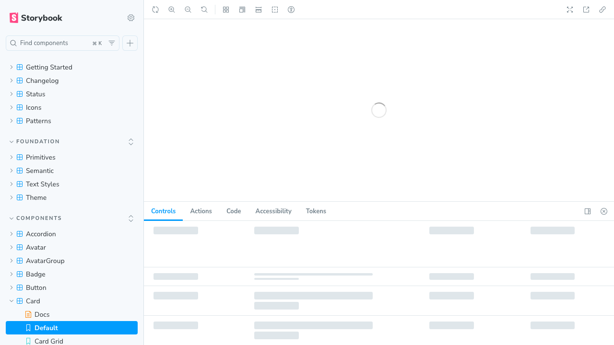

# Tokens Storybook Addon

A Storybook addon that adds a **Tokens** panel to the manager. It reads token metadata
from the active story and highlights the matching live element in the preview canvas.
It is framework-agnostic and does not require a particular token package, CSS framework,
or design system.



The example shows the intended interaction: hovering a `color` row in the Tokens panel
highlights the exact live button element whose background token is being inspected.

## Install

```bash
pnpm add -D tokens-storybook-addon
```

Register it in `.storybook/main.ts`:

```ts
import type { StorybookConfig } from '@storybook/react-vite';

const config: StorybookConfig = {
  addons: ['tokens-storybook-addon'],
};

export default config;
```

Configure the DOM convention and highlight colors in `.storybook/preview.ts`:

```ts
const preview = {
  parameters: {
    tokensAddon: {
      dataAttribute: 'data-token-part',
      variantAttribute: 'data-variant',
      highlightColor: '#2563eb',
      highlightColorSoft: 'rgba(37, 99, 235, 0.3)',
    },
  },
};

export default preview;
```

## Document tokens in a story

Put token metadata in `parameters.tokens`:

```ts
export const Primary = {
  args: { variant: 'primary', size: 'medium' },
  parameters: {
    tokens: [
      {
        part: 'button',
        label: 'Background',
        token: '--color-action-primary',
        kind: 'color',
        variant: 'primary',
      },
      {
        part: 'button-label',
        label: 'Label text',
        token: '--font-size-control-medium',
        kind: 'typography',
        size: 'medium',
        meta: 'Control label',
      },
      {
        part: 'button',
        label: 'Horizontal padding',
        token: '--space-3',
        kind: 'space',
        axis: 'horizontal',
      },
    ],
  },
};
```

Each item supports `part`, `label`, `token`, `value`, `kind`, `variant`, `size`,
`state`, `axis`, and `meta`. See [CONTRACT.md](CONTRACT.md) for the complete contract.

For color rows, add `colorRole: 'background' | 'text' | 'border' | 'icon' | 'asset'` so
the panel explains which visual surface uses the color. For spacing, use `padding` or
`paddingSides` for the exact padding zones, and `relationship` for gaps such as
`icon-to-text` or `header-to-text`.

`CONTRACT.md` is optional documentation, not a runtime dependency. The addon works
without it as long as the story provides `parameters.tokens`, the component renders the
configured DOM attribute, and the addon is registered in Storybook. Keep the contract when
you want a shared reference for humans, tests, or coding agents.

The `part` must match the configured DOM attribute on the live element:

```tsx
<button data-token-part="button" style={{ background: 'var(--color-action-primary)' }}>
  Save
</button>
```

## Use with any LLM or coding agent

The addon does not depend on a specific AI provider. Copy the instruction below into
the instruction file or system prompt used by your coding agent:

```md
When adding or editing a Storybook component, document every visible design token in
parameters.tokens. Inspect the rendered markup and CSS first. Use the exact data-token-part
value from the DOM. Use kind=color for colors, typography for text metrics, space for
padding/margin/gap, radius for corners, shadow for elevation, and other for values that do
not fit those groups. Add one row for each distinct padding side, spacing relationship,
state, variant, or size actually rendered. Use value for literal CSS values and token for
CSS custom properties. Do not invent rows for CSS properties the component does not
consume. After editing, run Storybook and verify that hovering each row highlights the
correct live element.
```

### Where to install the instruction

| Tool or workflow | Recommended location |
| --- | --- |
| Claude Code | `.claude/CLAUDE.md` |
| ChatGPT, Copilot, or another IDE agent | Project instructions, workspace rules, or the agent's system prompt |
| Cursor | `.cursor/rules/tokens-storybook-addon.mdc` |
| Generic repository agents | `AGENTS.md` or `CONTRIBUTING.md` |
| Documentation-aware agents | `llms.txt` or the project's AI documentation index |

The same text works in all of these locations. Only the filename and frontmatter format
change between tools.

For a new component, ask the agent to:

1. Add the `data-token-part` attributes to the exact DOM elements that own each value.
2. Add `parameters.tokens` to the component stories.
3. Use the most specific `part` for each row.
4. Add focused stories for variants, sizes, and disabled states when those values differ.
5. Run the Storybook build and verify every row highlights the expected preview element.

## Adding a new token category

The built-in categories are Color, Typography, Spacing, Radius, Sizing, and Shadows.
Spacing and sizing are both represented by `kind: 'space'` and are split automatically.

To add a new category, for example `motion`:

1. Add `motion` to the allowed `kind` values in [CONTRACT.md](CONTRACT.md).
2. Add `motion` to the category order and display labels in `register.js`.
3. Decide how the preview highlight should behave in `preview.js`.
4. Add a story example and document the new behavior in `CONTRACT.md`.
5. Run `pnpm pack` and test the addon in a clean Storybook project.

Do not add a category only to display data. Every category must explain which live DOM
element it highlights and what the highlight means.

## Development

```bash
pnpm pack --pack-destination /tmp/tokens-storybook-addon
```

The package is intentionally small and has no runtime dependency on a token library.

## Made by Marta Conde

I create design systems, component libraries, and AI-ready design tooling for freelance
projects. For collaborations, consulting, or more resources:

- [Website and contact](https://martaconde.com/)
- [LinkedIn](https://www.linkedin.com/in/martacondedesign/)
- [YouTube](https://www.youtube.com/@martacondedesign)
- [Free resources](https://martaconde.com/)
